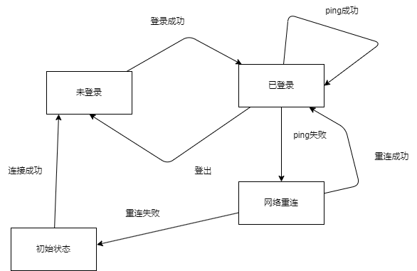
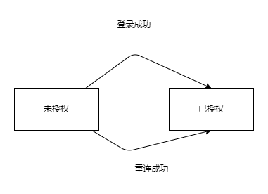

# 功能

- 客户端通信
- 2024-5-20
- zuiyu1998

## 概述

描述了客户端和服务器的通信。

## 指南级别的解释

客户端需要登录才能正常使用功能
客户端和服务器需要心跳保持连接，在连接断开时需要重连。
客户端可以正常传输聊天消息。
客户端可以维护好友等关系。

## 参考级别解释

客户端和服务器的通信统一抽象为 Msg。现在的声明如下:

```proto
message Msg {
  oneof union {
    ChatMsg chat_msg = 1;
    UserControlMsg user_control_msg = 2;
  }
}
```

### 心跳

在 Msg 添加心跳消息。声明如下:

```proto
message Ping {
}

message Pong {

}

message Msg {
  oneof union {
    ChatMsg chat_msg = 1;
    UserControlMsg user_control_msg = 2;
    Ping ping = 3;
    Pong Pong = 4;
  }
}
```

### 登录/登出

在 Msg 添加登录和登录消息，声明如下:

```proto
message LoginRequest {
    string email = 1;
    string password = 2;
}

message LoginResponse {
    enum LoginResponseCode {
      Ok = 0;
      NotFound = 1;
    }
    LoginResponseCode code = 1;
    int64 user_id = 1;
}

message LogoutRequest {
    Platfrom platfrom = 3;
    int64 user_id;

}

message LogoutResponse {
}

message Msg {
  oneof union {
    ChatMsg chat_msg = 1;
    UserControlMsg user_control_msg = 2;
    Ping ping = 3;
    Pong Pong = 4;
    LoginRequest login = 5;
    LoginResponse login_res = 6;
    LogoutRequest logout = 7;
    LogoutResponse logout_res = 8;
  }
}
```

### 客户端状态管理

客户端状态机示意图如下:


客户端共有三种状态，一个是未登录，一个已登录，一个网络重连中。
未登录为初始态，在连接建立后，便会发送登录请求，登录成功便会进入登录态。只有登录态会进行有用消息的传送，同时也会进行心跳检测。
如果心跳检测失败，客户端进入网络重连。网络重连失败进入未登录状态。

### 服务器连接状态管理

服务端状态机示意图如下:

服务器会话共有三种状态，一种是未登录，一个是已登录，未登录为初始态，在连接建立后，服务端会等待登录消息，直到认证完成。
