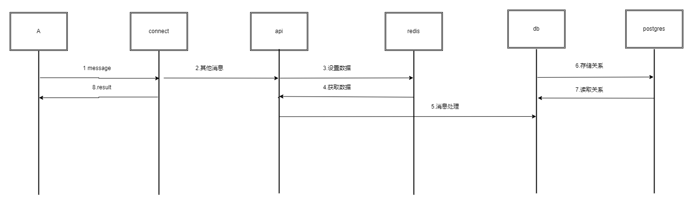

# 功能

- 接口消息时序
- 2024-05-21
- zuiyu1998

## 概述

一个 IM 处理常规意义上的聊天消息，通常还会维护好友，组等关系。这些关系的变更称为用户控制消息。除了这些外，用户的登录与登出也是十分重要的消息。

## 指南级别的解释

其他消息时序图如下:


实现的其他消息:

- 登录消息
- 登出消息

## 参考级别解释

### 登录与登出消息

登录与登出消息的声明如下:

```proto
message LoginRequest {
    string username = 1;
    string password = 2;
    Platfrom platfrom = 3;
}

message LoginResponse {
    enum LoginResponseCode {
        Ok = 0;
    }
    LoginResponseCode code = 1;
    int64 user_id = 2;
}

message LogoutRequest {
    Platfrom platfrom = 1;
    int64 user_id = 2;
}

message LogoutResponse {
}
```
