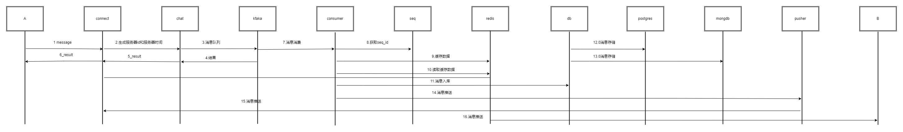

# 功能

- 消息通信时序
- 2024-5-16
- zuiyu1998

## 概述

next-im 的消息通信时序图，用于整体设计。

## 指南级别的解释

消息通信时序的示意图如下。

这个示意图体现了一个消息从客户端 A 到客户端 B 要可能经历的所有服务。

- 消息从客户端 A 发出到 connect 服务。
- connect 服务将收到的消息发送到 chat 服务。
- chat 服务生成服务器 id 和服务器事件后，发送给消息队列。
- 消费服务消费消息，同时从缓存中获取对应数据，在此通过 seq 服务获取消息的递增序列。在整个消息完成后向 db 服务和 pusher 发送服务。
- db 服务存储响应的聊天消息
- pusher 服务向 connect 服务发送消息，
- connect 服务向客户 B 发送消息
